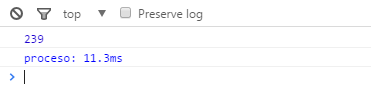

Posiblemente hayas oído hablar del motor V8 de Google. También el motor de renderizado *Blink* (de algún modo el sucesor de WebKit en la mayoría de las plataformas) ha cosechado cierto nombre. Ambos son usados por Chrome y apuntan a una experiencia web satisfactoria, y con satisfactoria me refiero principalmente a **rápida**.

Sin embargo la optimización tiene un precio. Si queres exprimir las posibilidades de estas tecnologías tienes que jugar a su modo. Hay muchos post interesantes sobre como reducir el tiempo de *scripting*, presentaciones de Google enfocadas a un código óptimo. Estas mejoras son muy interesantes y darán para otros posts futuros, pero hoy quiero hablar de algo menos conocido y que también tiene su importancia.

## El diseño sincrónico forzado
El nombre da a entender que será algo complejo y que necesitará de un profundo estudio de las tripas del V8, entre C y C++. Nada más lejos de la realidad.

Para entender que significa esto, primero tenemos que ver el ciclo de scripting y pintado de Chrome.

Javascript --> Estilo --> Diseño

Normalmente se sigue este orden. Primero se ejecuta el Javascript, y despues el diseño. Pero ¿y qué pasa si para poder continuar con la ejecución del Javascript necesitamos acceder a un dato que solo sabremos tras haber pintado el documento? Pues que este orden cambiará, y se pintará antes de continuar con la ejecución del script.

Por supuesto podemos acceder a los valores del marco anterior sin impacto en el rendimiento. En otras palabras: **puedes consultar un estilo de cualquier elemento del DOM siempre y cuando no hayas cambiado algún estilo de ese elemento previamente.**

Vamos con un ejemplo. Tenemos una página con muchos elementos. En mi ejemplo, para simplificar, todo son cajas con un color de fondo. Si quieres cambiar el tamaño de una caja y mostrar por consola el nuevo tamaño, tendrás dos opciones.

Opción 1:

/*Un elemento cualquiera*/
var caja = document.getElementById("caja")

/*Le añadimos una clase que le da más tamaño*/
var incrementoDeTamanio = 50;
caja.style.width = caja.offsetWidth + incrementoDeTamanio;

/*Mostramos en consola el nuevo tamaño*/
console.log(caja.offsetWidth)


Opción 2:

/*Un elemento cualquiera*/
var caja = document.getElementById("caja")

/*Almacenamos el tamaño inicial en una variable*/
var tamanioInicial = caja.offsetWidth;
var incrementoDeTamanio = 50;
var tamanioFinal = tamanioInicial + incrementoDeTamanio

/*Le añadimos una clase que le da más tamaño*/
caja.style.width = tamanioFinal;

/*Mostramos en consola el nuevo tamaño*/
console.log(tamanioFinal)


A primera vista la primera forma puede parecer más óptima. Al menos desde el punto de vista del número de líneas. Ahora vamos a ver el tiempo que han tardado:

Opción 1:

Opción 2:

Unos milisegundos pueden no parecer mucho, pero hablamos de multiplicar por más de 5 el tiempo necesario para hacer lo mismo.

[Ejemplo](https://github.com/DavidColladoGitHub/blogExamples/tree/master/Rendimiento%20Chrome) en GitHub

## Hiperpaginácion de diseños
Otro concepto que suena más complicado de lo que realmente es. Se trata de usar un código que fuerce el diseño sincrónico forzado dentro de un bucle.

En este ejemplo vamos a cambiar el tamaño el ancho de todos los divs de la página llamados *caja* para que tengan el mismo que la primera caja.


function redimensionarCajas() {
  for (var i = 0; i < caja.length; i++) {
    caja[i].style.width = primeraCaja.offsetWidth + 'px';
  }
}


En cada iteración del bucle de este ejemplo se tiene que calcular el tamaño de la primera caja. Como es una consulta de estilo, Chrome tiene que adelantar la fase de pintado para poder coger el tamaño previo.

Hecho bien


var width = primeraCaja.offsetWidth;

function redimensionarCajas() {
  for (var i = 0; i < caja.length; i++) {
    caja[i].style.width = width + 'px';
  }
}


De este modo evitamos tener que repintar constantemente.

## Notas finales
Esto solo se aplica a Chrome.

## Referencias:
[Evite los diseños grandes y complejos, y la hiperpaginación de diseños](https://developers.google.com/web/fundamentals/performance/rendering/avoid-large-complex-layouts-and-layout-thrashing?hl=es-419)
